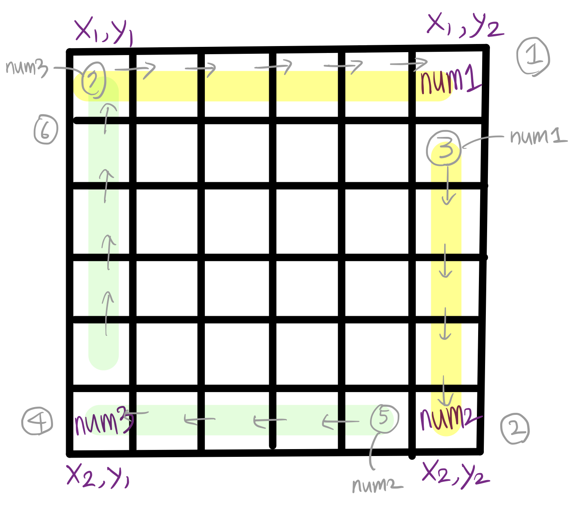

# 행렬 테두리 회전하기

> [프로그래머스 코딩테스트 연습 > 2021 Dev-Matching: 웹 백엔드 개발자 > 로또의 최고 순위와 최저 순위](https://programmers.co.kr/learn/courses/30/lessons/77485)
> 출처: 프로그래머스 코딩 테스트 연습, https://programmers.co.kr/learn/challenges

- Level2

## 해결 과정 👍



1. index 에 신경 쓰면서 queries 로 주어지는 `(x1,y1) ~ (x2, y2)`의 테두리를 회전한다.

   - ①, ② 는 이전 위치의 값을 가져와야 하므로 `0` 이상의 index를 갖는지 체크해야 하며
   - ④, ⑥ 은 다음 위치의 값을 가져와야 하므로 각 최대 index `(x2, y2)`를 넘지 않는지 체크해야 한다.

2. 위/아래 테두리의 값, 왼쪽/오른쪽 테두리의 값들 중 최소 값을 결과로 반환한다.

## 코드 1

```kotlin
fun solution(lottos: IntArray, win_nums: IntArray): IntArray {
        
      var answer = mutableListOf<Int>()
      val zero = lottos.filter {
          it == 0
      }.size

      var same = 0
      lottos.forEach { num ->
          win_nums.forEachIndexed { idx, win_num ->
              if (num == win_num) {
                  same++
              }
          }
      }

      answer.add(7 - Math.max(same + zero, 1))
      answer.add(7 - Math.max(same, 1))
      return answer.toIntArray()
  }
```

## 다른 사람 코드 
```kotlin
fun solution(lottos: IntArray, winNums: IntArray): IntArray {
    return intArrayOf(
            (lottos.size.plus(1)) - lottos.filter { winNums.contains(it) || it == 0 }.size,
            (lottos.size.plus(1)) - lottos.filter(winNums::contains).size
    ).map { if (it > 6) it - 1 else it }.toIntArray()
}
```

## 배운 점

- 클래스 참조로 filter 사용 -> lottos.filter(winNums::contains).size

