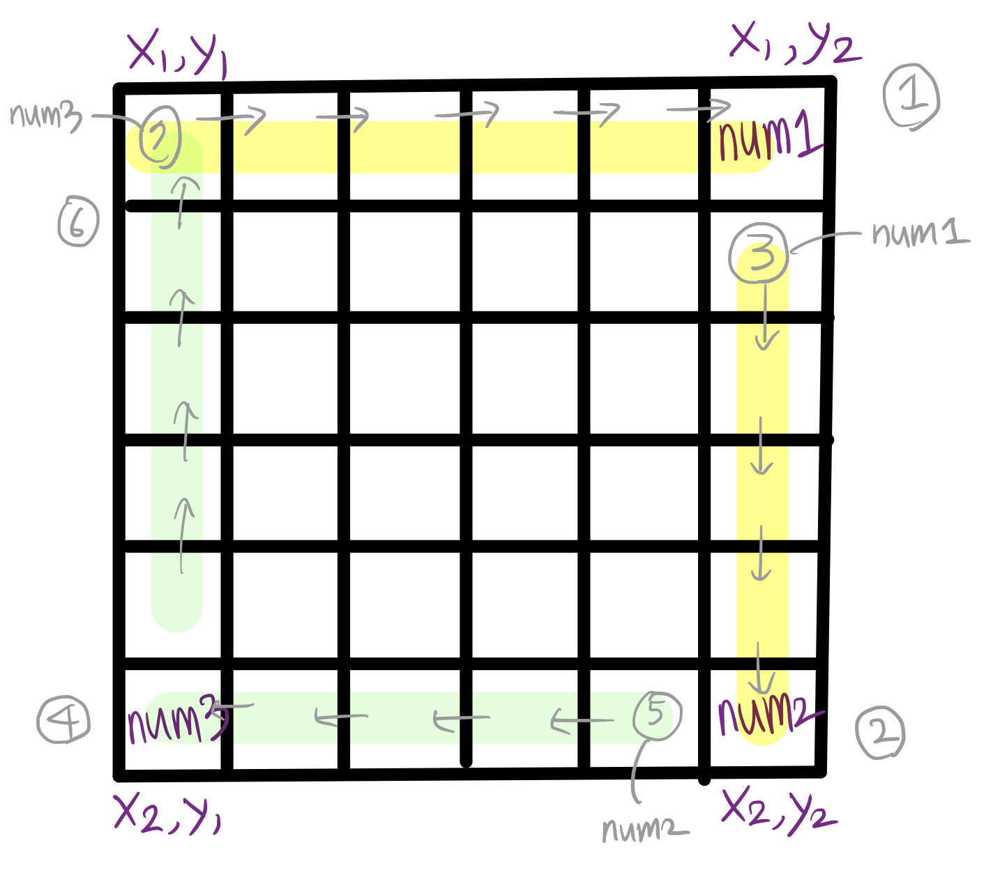

# 행렬 테두리 회전하기

> [프로그래머스 코딩테스트 연습 > 2021 Dev-Matching: 웹 백엔드 개발자(상반기) > 행렬 테두리 회전하기](https://programmers.co.kr/learn/courses/30/lessons/77485)
> 출처: 프로그래머스 코딩 테스트 연습, https://programmers.co.kr/learn/challenges

- Level2

## 해결 과정



1. index 에 신경 쓰면서 queries 로 주어지는 `(x1,y1) ~ (x2, y2)`의 테두리를 회전한다.

   - ①, ② 는 이전 위치의 값을 가져와야 하므로 `0` 이상의 index를 갖는지 체크해야 하며
   - ④, ⑥ 은 다음 위치의 값을 가져와야 하므로 각 최대 index `(x2, y2)`를 넘지 않는지 체크해야 한다.

2. 위/아래 테두리의 값, 왼쪽/오른쪽 테두리의 값들 중 최소 값을 결과로 반환한다.

## 코드 1

```kotlin
fun solution(rows: Int, columns: Int, queries: Array<IntArray>): IntArray {
    val answer = IntArray(queries.size)
    var num = 1
    val arr = Array(rows) { Array(columns) { num++ } }
    queries.forEachIndexed { idx, it ->
        val x1 = it[0] - 1
        val y1 = it[1] - 1
        val x2 = it[2] - 1
        val y2 = it[3] - 1

        val num1 = arr[x1][y2]
        val num2 = arr[x2][y2]
        val num3 = arr[x2][y1]
        for (j in y2 downTo y1) if(j-1 >= 0) arr[x1][j] = arr[x1][j - 1]
        for (i in x2 downTo x1+1) if(i-1 >= 0) arr[i][y2] = arr[i - 1][y2]
        arr[x1+1][y2] = num1
        for (j in y1 until y2) if(j+1 <= y2) arr[x2][j] = arr[x2][j + 1]
        arr[x2][y2-1] = num2
        for (i in x1 until x2) if(i+1 <= x2) arr[i][y1] = arr[i + 1][y1]
        arr[x2-1][y1] = num3

        var min = Int.MAX_VALUE
        for (j in y1..y2) {
            if (min > arr[x1][j]) min = arr[x1][j]
            if (min > arr[x2][j]) min = arr[x2][j]
        }
        for (i in x1..x2) {
            if (min > arr[i][y1]) min = arr[i][y1]
            if (min > arr[i][y2]) min = arr[i][y2]
        }
        answer[idx] = min
    }
    return answer
}
```

## 배운 점

- 배열을 사용할 때는 index 범위를 꼭 신경 써야 한다.
  - index 체크를 제거하면, `rows: 3, columns: 3, queries: [[1,1,2,2],[1,2,2,3],[2,1,3,2],[2,2,3,3]], resut: [1, 1, 5, 3]` test case가 풀리지 않는다.
