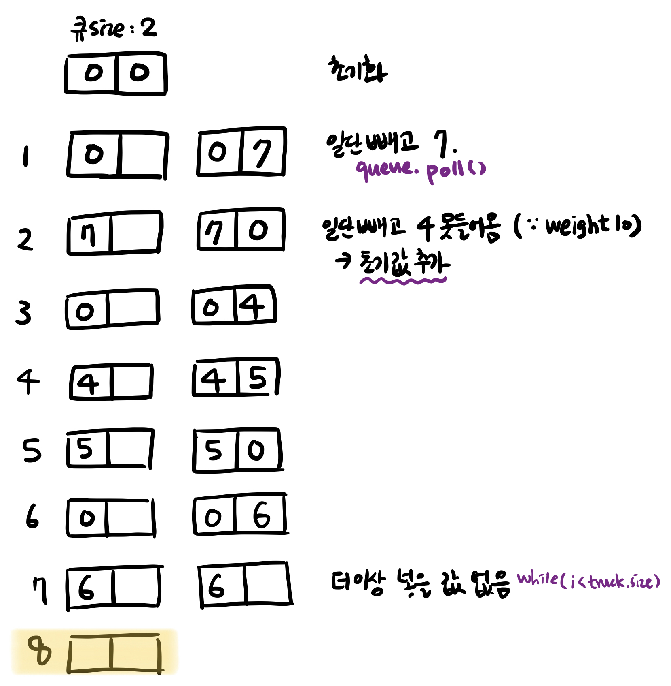

# 다리를 지나는 트럭.

> [프로그래머스 코딩테스트 연습 > 스택/큐 > 다리를 지나는 트럭.](https://programmers.co.kr/learn/courses/30/lessons/42583)
> 출처: 프로그래머스 코딩 테스트 연습, https://programmers.co.kr/learn/challenges

- Level2
- Queue

## 해결 과정

1. 다리와 대기 트럭을 Queue로 선언해준다.
2. 대기 트럭은 입력 값에서 가져오고 다리 Queue의 크기를 다리 길이만큼 해주기 위해 초기에 0으로 채워서 초기화 한다.
3. 대기 트럭에서 poll한 트럭을 다리 Queue로 넣어주고 다리 큐에서 poll을 통해 맨 앞의 트럭을 빼준다.
4. 이때 다리를 지나는 트럭의 무게를 계산해서 트럭을 옮겨준다.
5. 그리고 다리에 모든 데이터가 없어지면 종료한다.

## 코드 1

```kotlin
fun solution(bridge_length: Int, weight: Int, truck_weights: IntArray): Int {
    var answer = 0

    // 다리를 건너는 트럭
    val bridgeTruckQueue = LinkedList<Int>()
    // 대기 트럭
    val waitTruckQueue = LinkedList<Int>()

    // 다리 길이만큼 임의의 숫자 0을 채워줌 (다리 길이 만큼 시간 + 1 ex: 다리 길이가 2면 time 2)
    for (i in 0 until bridge_length) bridgeTruckQueue.add(0)
    for (i in truck_weights) waitTruckQueue.add(i)

    // 모두 통과할 때 까지
    while (bridgeTruckQueue.isNotEmpty()) {
        bridgeTruckQueue.poll()
        if (waitTruckQueue.isNotEmpty()) {
            // 다리가 견딜 수 있는 무게 weight 무게를 초과하지 않는다면 큐에 삽입
            if (bridgeTruckQueue.sum() <= weight - waitTruckQueue.peek()) {
                bridgeTruckQueue.add(waitTruckQueue.poll())
            } else {
                bridgeTruckQueue.add(0)
            }
        }
        answer++
    }
    return answer
}
```

## 코드 2: eunji

```kotlin
import java.util.*
class Solution {
    fun solution(bridge_length: Int, weight: Int, truck_weights: IntArray): Int {
        var answer = 0
        val queue: Queue<Int> = LinkedList<Int>().apply {
            for (i in 0 until bridge_length) add(0)
        }
        var i = 0
        while (queue.isNotEmpty()) {
            answer += 1
            queue.poll()
            if (i < truck_weights.size) {
                if (queue.sum() + truck_weights[i] <= weight) {
                    queue.add(truck_weights[i++])
                } else {
                    queue.add(0)
                }
            }
        }
        return answer
    }
}
```

## 배운 점

- 다리를 건너는 조건을 잘못하면 시간 초과 걸린다.
- `peek` 는 값을 꺼내지 않고 확인 가능 (복습)
- `Queue` 초기화 방법

```kotlin
val bridgeQueue: Queue<Int> = LinkedList(List(bridge_length){0})
val waitingQueue: Queue<Int> = LinkedList(truck_weights.toList())
```

- 큐에서 한 칸씩 이동시키는 방법을 배웠다.
  
  1. Queue의 개수만큼 초기화 아이템을 넣어 초기화 함.
  2. Queue를 돌면서 값을 일단 빼고 (`queue.poll()`)
  3. 큐에 넣을 값이 있다면 넣고 / 없다면, 초기화 아이템을 다시 넣음. (큐에 들어 있는 값들이 한칸 전진하는 효과)
