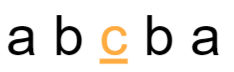

# 가장 긴 팰린드롬

> [프로그래머스 코딩테스트 연습 > 연습문제 > 가장 긴 팰린드롬](https://programmers.co.kr/learn/courses/30/lessons/12904)
> 출처: 프로그래머스 코딩 테스트 연습, https://programmers.co.kr/learn/challenges

- Level3

## 해결 과정

1. 문자열 길이부터(홀수, 짝수) 팰린드롬 체크하고, 길이를 늘려 가면서 조건을 검사한다.
2. 좌,우 범위를 넘어가지 않도록 한다. (기존 최대 길이 갱신)

- 푸는 방법은 여러가지 존재한다. 이해하기 쉬운 방법으로 푸는것이 좋은것 같다.

- 참고 이미지



## 코드 1

```kotlin
fun solution(s: String): Int {
    var answer = 1
    for (i in s.length downTo 0) {
        answer = answer.coerceAtLeast(palindromeLength(s, i, i)) // palindrome이 홀수일때 길이
        answer = Math.max(answer, palindromeLength(s, i, i + 1)) // palindrome이 짝수일때 길이
    }
    return answer
}

fun palindromeLength(s: String, left: Int, right: Int): Int {
    var left = left
    var right = right
    while (left >= 0 && right < s.length && s[left] == s[right]) {
        left--
        right++
    }
    return right - left - 1
}
```

## 코드 2
```kotlin
fun solution(s: String): Int {
    val chr = s.toCharArray()
    // 가장 긴 문자열부터 팰린드롬 검사
    for (leng in s.length downTo 2) {
        // 시작 인덱스
        var start = 0
        while (start + leng <= s.length) {
            var chk = true
            // 처음부터 문자열 길이의 반틈만큼 문자가 같은지 비교
            for (i in 0 until leng / 2) {
                if (chr[start + i] != chr[start + leng - i - 1]) {
                    chk = false
                    break
                }
            }
            if (chk) return leng
            start++
        }
    }
    return 1
}
```

## 배운 점
- 회문(영어로 팰린드롬)을 배웠다. 어렵다.
- Math.max -> coerceAtLeast 사용해 봄
