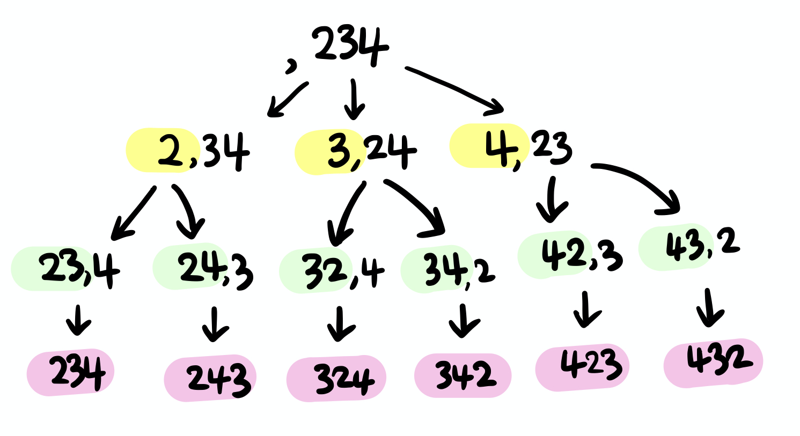

# 소수 찾기

> [프로그래머스 코딩테스트 연습 > 완전탐색 > 소수 찾기](https://programmers.co.kr/learn/courses/30/lessons/42839)
> 출처: 프로그래머스 코딩 테스트 연습, https://programmers.co.kr/learn/challenges

- Level2
- 완전탐색 (출제 빈도: 높음, 평균 점수: 낮음)

## 해결 과정

1. 주어진 numbers 로 만들 수 있는 모든 순열을 찾고, 중복되지 않도록 hashSet에 저장한다.
   
2. 소수인지를 검사해서 반환한다.

## 코드 1

```kotlin
fun solution(numbers: String): Int {
    val set = hashSetOf<Int>()
    permutation("", numbers, set)
    return set.filter { isPrime(it.toInt()) }.map { 1 }.sum()
}

fun permutation(result: String, numbers: String, set: HashSet<Int> ) {
    if (result.isNotEmpty()) {
        set.add(result.toInt())
    }
    for (i in 0 until numbers.length) {
        permutation(
            result + numbers[i],
            numbers.substring(0, i) + numbers.substring(i + 1),
            set)
    }
}

fun isPrime(n: Int) : Boolean {
    if(n<2) return false
    for(i in 2 until n) {
        if(n%i==0) return false
    }
    return true
}
```

## 코드 2 (orange4912)
```kotlin
val hashSetResult = hashSetOf<Int>()
fun solution(numbers: String): Int {
  for(i in 1.. numbers.length) {
      permutation(
          i,
          0,
          IntArray(i),
          numbers.map { Character.getNumericValue(it) }.toIntArray(),
          BooleanArray(numbers.length)
      )
  }
  return hashSetResult.size
}

private fun permutation(
  r: Int,
  depth: Int,
  result: IntArray,
  numbers: IntArray,
  visited: BooleanArray) {
  if (r == depth) {
      val permNumber = result.joinToString("")
      if (permNumber.isNotEmpty() && isPrime(permNumber.toInt())) {
          hashSetResult.add(permNumber.toInt())
      }
      return
  } else {
      for (i in numbers.indices) {
          if (!visited[i]) {
              visited[i] = true
              result[depth] = numbers[i]
              permutation(r, depth + 1, result, numbers, visited)
              visited[i] = false
          }
      }
  }
}

fun isPrime(num: Int): Boolean {    
  if(num < 2) return false
  if(num == 2 || num == 3) return true

  val end = Math.sqrt(num.toDouble())
  for(i in 2 .. end.toInt()) {
      if(num % i == 0) {
          return false
      }
  }
  return true
}

```
## 배운 점

- 순열 찾는 전형적인 코드에 대해서 배울 수 있었다.
- 참고: [10974](https://www.acmicpc.net/problem/10974)

- 사고의 전환이 필요함, 코드 1 짱임^^
- char toInt() 는 아스키코드로 변환 된다.
- Character.getNumericValue("1") -> 1

## 질문
- 복습중에 궁금한 점이 있어서요. map { 1 } 이렇게 변화하면 arrayList<int> 모든 값 1 이 나오는데 모든 아이템을 1로 변환 하는 코드인지요?
   
